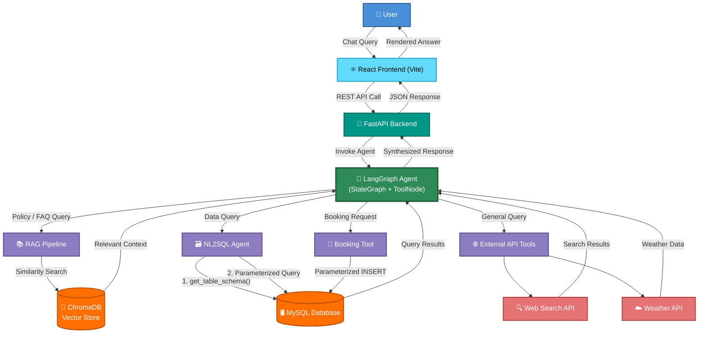
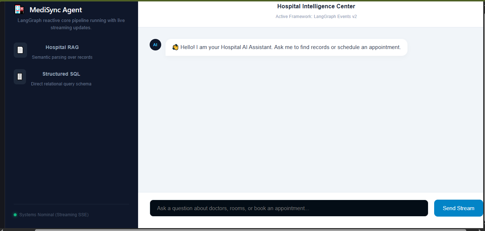
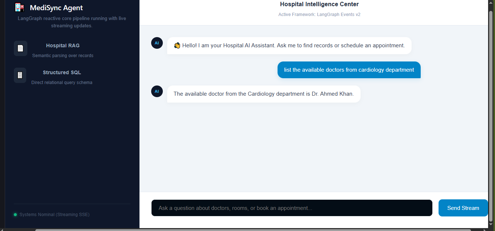

<div align="center">

# 🏥 MediSync

### An Intelligent, Multimodal Hospital Operations Assistant Powered by Multi-Agent AI

*Bridging the gap between LLM automation and real-world hospital infrastructure.*

[](https://www.python.org/)
[](https://fastapi.tiangolo.com/)
[](https://react.dev/)
[](https://www.langchain.com/)
[](https://www.langchain.com/langgraph)
[](https://www.mysql.com/)
[](https://www.trychroma.com/)
[](https://www.docker.com/)
[](#)

</div>

---

## 📖 Overview

**MediSync** is a production-grade, multi-agent AI system designed to modernize hospital front-desk and administrative operations. Rather than acting as a simple chatbot, MediSync is architected around a **LangGraph state machine** that intelligently routes natural language queries to specialized tools — retrieving policy documents, querying live relational hospital data, booking appointments, and pulling in external context — all through a single, unified conversational interface.

For healthcare administrators, this translates directly into **reduced front-desk workload, faster patient query resolution, and fewer data-entry errors**, while maintaining strict guardrails against the two biggest risks of applying LLMs to sensitive operational data: **hallucinated database queries** and **unsafe SQL execution**.

The entire system is fully containerized, environment-isolated, and built to be deployed — not just demoed.

---

## ✨ Key Features

- 🧠 **Multi-Agent Orchestration with LangGraph** — A `StateGraph` with `ToolNode` routing directs each user query to the correct specialized agent, maintaining full conversational state via `add_messages`.

- 📚 **Hospital RAG System** — Ingests hospital policy documents and manuals (via `PyPDF`), embeds them into **ChromaDB**, and retrieves grounded, citation-backed answers to questions like visiting hours, department policies, and insurance FAQs.

- 🗃️ **Intelligent Natural-Language-to-SQL Agent** — Converts plain-English questions into safe, accurate SQL queries against real hospital tables (`patients`, `doctors`, `appointments`, `medical_records`, and more).
  - 🛡️ **Anti-Hallucination Guardrail:** The agent is required to call a `get_table_schema` tool to verify real column names and types *before* generating any query — eliminating a major failure mode of naive text-to-SQL systems.

- 📅 **Automated Appointment Booking Engine** — Conversationally collects patient name, department, date, and time, validates the input, and safely commits it via **parameterized `INSERT` statements** into the `bookings` table.

- 🌐 **External API Tooling** — Integrates Web Search and Weather tools for general-purpose queries, scoped tightly through prompt engineering to prevent tool misuse or scope creep.

- 🔒 **Security-First Design** — Parameterized queries (`%s`) prevent SQL injection; secrets are isolated via `.env`, `.gitignore`, and `.dockerignore`, and injected at container runtime — never baked into images.

- 🐳 **Fully Containerized Deployment** — Isolated Docker networks for frontend and backend eliminate "works on my machine" issues and mirror a real production topology.

---

## 🏗️ System Architecture

MediSync's core intelligence lives in a LangGraph agent that sits behind a FastAPI service layer, with a decoupled React frontend. The agent dynamically selects between the RAG pipeline, the SQL engine, the booking tool, and external APIs based on the intent of each query.



### Component Breakdown

| Layer | Technology | Responsibility |
|---|---|---|
| **Frontend** | React (Vite) | Chat UI, session handling, API communication |
| **Backend API** | FastAPI | Request validation, routing, agent invocation |
| **Orchestration** | LangGraph (`StateGraph`, `ToolNode`) | Intent routing, conversation state, tool dispatch |
| **Knowledge Layer** | ChromaDB + PyPDF | Document ingestion & semantic retrieval (RAG) |
| **Data Layer** | MySQL | Relational storage for patients, appointments, records |
| **External Layer** | Web Search / Weather APIs | General-purpose contextual queries |
| **Infrastructure** | Docker + Docker Compose | Isolated, networked, reproducible deployment |

---

## ✅ Prerequisites

Before running MediSync, ensure you have the following installed:

- 🐳 [Docker](https://docs.docker.com/get-docker/) (v20.10+)
- 🐙 [Docker Compose](https://docs.docker.com/compose/install/) (v2.x — bundled with Docker Desktop)
- 🖥️ [Docker Desktop](https://www.docker.com/products/docker-desktop/) (recommended for Windows/macOS users)
- 🔑 An **OpenAI API key** (and optionally, a Web Search / Weather API key, depending on configuration)

> No local Python, Node, or MySQL installation is required — everything runs inside containers.

---

## 🚀 Quick Start / Installation

### 1️⃣ Clone the Repository

```bash
git clone https://github.com/<your-username>/medisync.git
cd medisync
```

### 2️⃣ Configure Environment Variables

Create a `.env` file in the project root (this file is git-ignored and never committed):

```bash
cp .env.example .env
```

**`.env.example`**

```env
# --- LLM Configuration ---
OPENAI_API_KEY=sk-xxxxxxxxxxxxxxxxxxxxxxxxxxxxxxxx

# --- MySQL Database ---
MYSQL_HOST=mysql_db
MYSQL_PORT=3306
MYSQL_DATABASE=medisync_db
MYSQL_USER=medisync_user
MYSQL_PASSWORD=change_me_in_production
MYSQL_ROOT_PASSWORD=change_me_too

# --- Vector Store ---
CHROMA_DB_PATH=./data/chroma_store

# --- External Tools ---
WEB_SEARCH_API_KEY=your_search_api_key
WEATHER_API_KEY=your_weather_api_key

# --- App Config ---
BACKEND_PORT=8000
FRONTEND_PORT=5173
```

Fill in your real credentials before proceeding.

### 3️⃣ Build & Run with Docker Compose

```bash
docker compose up --build
```

This will:
- 🏗️ Build isolated images for the **frontend** and **backend**
- 🔗 Spin up separate Docker networks for frontend/backend isolation
- 🛢️ Provision the MySQL database and initialize schema
- 📦 Mount and persist the ChromaDB vector store

### 4️⃣ Access the Application

| Service | URL |
|---|---|
| 🌐 Frontend (Chat UI) | `http://localhost:5173` |
| ⚙️ Backend API Docs (Swagger) | `http://localhost:8000/docs` |

To stop all services:

```bash
docker compose down
```

---

## 💬 Usage Examples

Once running, try asking MediSync natural-language questions such as:

**🏥 Policy / RAG Query**
> "What are the hospital's visiting hours on weekends?"

**🗃️ Database Query (NL2SQL)**
> "How many patients are currently admitted under the Cardiology department?"

**📅 Appointment Booking**
> "Book an appointment with Cardiology for John Doe tomorrow at 10 AM."

**🌐 General / External Query**
> "What's the weather looking like in the city today? Should I expect delays getting to the hospital?"

Behind the scenes, the LangGraph agent classifies each query's intent, invokes the correct tool chain (schema verification → SQL execution, or vector retrieval, or booking insert), and returns a synthesized, natural-language response.

---

## 📸 Screenshots & Demo

A quick visual tour of MediSync in action.

<div align="center">

### 💬 Chat Interface



*The React-based chat UI handling a natural-language hospital query.*

<br/>

### 🗃️ NL2SQL Query in Action



*The agent verifying schema before executing a safe, parameterized SQL query.*

<br/>

### 📅 Appointment Booking Flow


*Conversational appointment booking, from intent to confirmed database entry.*

<br/>

### 🎥 Full Demo Recording

[](https://your-video-link-here.com)

*Click the thumbnail above to watch a full walkthrough of MediSync — RAG queries, NL2SQL, and appointment booking end-to-end.*

</div>

> 💡 **Note:** Place your actual screenshot images inside a `docs/screenshots/` directory in your repo, and replace the demo link above with your hosted video (YouTube, Loom, or a GitHub-hosted `.mp4`/`.gif`). GitHub also renders `.gif` recordings directly inline if you prefer an animated walkthrough over a static thumbnail + link.

---

## 📂 Project Structure (Reference)

```
medisync/
├── backend/
│   ├── agent/          # LangGraph StateGraph, nodes, tools
│   ├── api/             # FastAPI routes
│   ├── db/               # MySQL connection & schema utilities
│   ├── rag/              # PyPDF ingestion + ChromaDB retriever
│   └── Dockerfile
├── frontend/
│   ├── src/               # React (Vite) application
│   └── Dockerfile
├── docker-compose.yml
├── .env.example
└── README.md
```

---

## 🧭 Roadmap

- [ ] Role-based access control (Admin / Staff / Patient views)
- [ ] Multi-turn appointment rescheduling & cancellation
- [ ] Streaming responses via WebSockets
- [ ] Observability with LangSmith tracing
- [ ] CI/CD pipeline for automated container builds

---

## 👤 Author

**Allyan Khan**
*Software Engineer*

Interested in discussing this project, AI agent architecture, or collaboration opportunities? Let's connect.

[](#)
[](#)
[](#)

> Replace the `#` placeholders above with your actual LinkedIn, GitHub, and email links.

---

<div align="center">

⭐ **If you find this project interesting, consider giving it a star!** ⭐

*Built with a focus on production readiness, security, and real-world hospital operations.*

</div>
